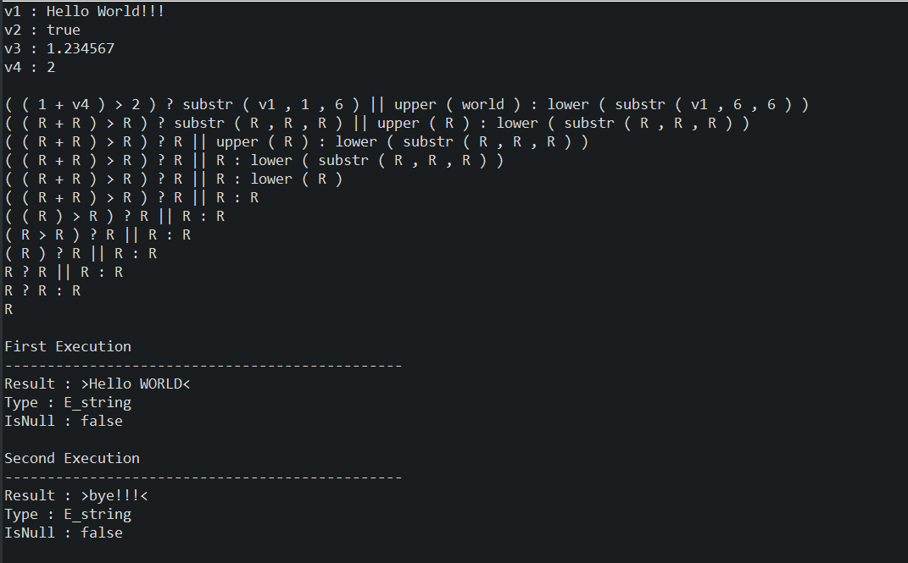

# JEvalExpr

<!-- ```
       _ ______          _ ______                
      | |  ____|        | |  ____|                
      | | |____   ____ _| | |__  __  ___ __  _ __ 
  _   | |  __\ \ / / _` | |  __| \ \/ / '_ \| '__|
 | |__| | |___\ V / (_| | | |____ >  <| |_) | |   
  \____/|______\_/ \__,_|_|______/_/\_\ .__/|_|   
                                      | |         
                                      |_|         
``` -->

Very effective Java Library and Tool to parse, compile and execute functions in a language SQL Like. Library is easy estensible with new functions, and it's possible passing a list of variables changing their values between executions.

<hr/>

## Table of contents

1. [Overview](#Overview)  
2. [Compile Function](#Compile-function)  
3. [Execution Function](#Execution-function)  
4. [Example](#Example)  
5. [List Functions](#List-Functions)  
6. [Line Command Tool](#Lct)  
6. [Test Tool](#Test-tool)  
7. [Add New Function](#Addnewfunction)  
8. [Authors](#Authors)  
9. [Prerequisites](#Prerequisites)  
10. [Built With](#Built-With)  
11. [Licence](#Licence)  

<hr/>

<h2 id="Overview">Overview</h2>

The **JEvalExpr** library allows interpret and compile even complex expressions in a language like SQL. It's possible to specify an array of variable names and their type (**Integer, Double, String and Boolean**) during the compilation. 

The compiled expression is simplified into an array of steps it can be executed, if there are variables during execution the array of variable names and relative values ​​must be passed (It is essential that the array has the same order used in compilation stage). Once compiled, the expression can be executed several times and obviously the values ​​of the variables, if present, can be modified between the various executions.  

<hr/>

<h2 id="Compile-function">Compile function</h2>

To compile an expression the following steps must be performed :  

1. **Instantiate an object of type Expression** :  

```
	public Expression(String expr, ArrayList<Variable<?>> var) {
		super();
		this.humanExpr = expr;
		this.variables = var;
	}
```

> Contructor accept two arguments :  
> - String  
> - ArrayList of Variable objects  

> Variable class :  

```
public class Variable<T> {
	private String name;
	private TypeData typeVariable;
	
	private T value;

	public Variable(String name, T value) {
		super();
		this.name = name;
		if ( Utility.isBoolean(value) ) this.typeVariable = TypeData.E_boolean;
		if ( Utility.isString(value) ) this.typeVariable = TypeData.E_string;
		if ( Utility.isInteger(value) ) this.typeVariable = TypeData.E_int;
		if ( Utility.isDouble(value) ) this.typeVariable = TypeData.E_double;
		this.value = value;
	}
	
	public T getValue() {
		return value;
	}
	
	public String getName() {
		return name;
	}

	public void setName(String name) {
		this.name = name;
	}

	public TypeData getTypeVariable() {
		return typeVariable;
	}

	public void setTypeVariable(TypeData typeVariable) {
		this.typeVariable = typeVariable;
	}

}
```

2. **Execute method compExpr() of object Expression** :  

```
public boolean compExpr() { ... }
```
> This method returns true if compilation is ok or false if nok. All logs are produced in stdout (see. Logger class).   

<hr/>

<h2 id="Execution-function">Execution function</h2>

To execute a compiled expression the following steps must be performed :  

1. **Execute method execExpr(...) of object Expression** :

```
public int execExpr(ArrayList<Variable<?>> variables) { ... }  
```

> It's very important that arrayList of variables has the same order and types of data used during compilaling.   
> This method returns true if compilation is ok or false if nok. All logs are produced in stdout (see. Logger class).   

3. **Execute method getResult(...) of object Expression** :

```
	public DataValue<?> getResult() {
		int idx = expBin.getStep().size()-1;
		if ( idx < 0 ) idx = 0;
		return expBin.getStep().get(idx).getData();
	}
```

> This method returns an object DataValue with the result expression's result and its type.  

```
public class DataValue<T> {

	TypeData typeData;
	boolean isNull;
	T value;
	
	public DataValue() {
		super();
	}

	public DataValue(T value) {
		super();
		this.value = value;
	}
	
	public TypeData getTypeData() {
		return typeData;
	}
	public void setTypeData(TypeData typeData) {
		this.typeData = typeData;
	}
	public boolean isNull() {
		return isNull;
	}
	public void setNull(boolean isNull) {
		this.isNull = isNull;
	}
	public T getValue() {
		return value;
	}
	public void setValue(T value) {
		this.value = value;
	}

}
```

> To get de type of result execute method getTypeData that returns a **TypeData** enum :  

```
public enum TypeData {
	  E_int,                      /* Type Integer                   */
	  E_double,                   /* Type Double                    */
	  E_string,                   /* Type String                    */
	  E_boolean,                  /* Type Boolean                   */
	  E_date,                     /* Type date (LocalDate, LocalDateTime or LocalTime) */
}
```

<hr/>

<h2 id="Example">Example</h2>

Here an example :

```
package com.gpsoft.jtestevalexpr;
import java.util.ArrayList;

import com.gpsoft.jevalexpr.Variable;
import com.gpsoft.jevalexpr.expr.Expression;
import com.gpsoft.jevalexpr.log.Logger;


public class JTestEvalExpr {
	
	static Expression expression = null;
	
	public static void execute(ArrayList<Variable<?>> variables) {
		  if ( expression.execExpr(variables) != 0 ) {
			  Logger.error("\nDuring execution");
		  } else {
			  Logger.info("\nExecution OK.");
			  Logger.always("-----------------------------------------------");
			  Logger.always("Result : >" + expression.getResult().getValue() + "<");
			  Logger.always("Type : " + expression.getResult().getTypeData());
			  Logger.always("IsNull : " + expression.getResult().isNull());
		  }
	}
	
	@SuppressWarnings("unchecked")
	public static void main(String args[]) throws Exception {
		
		  // Change Level of Log 
		  Logger.setLevel(8);
		  String Expression = "";


		  
		  ArrayList<Variable<?>> variables = new ArrayList<Variable<?>>();
		  
		  variables.add(new Variable<String>("v1", "Hello World!!!"));
		  variables.add(new Variable<Boolean>("v2", true));
		  variables.add(new Variable<Double>("v3", 1.234567));
		  variables.add(new Variable<Integer>("v4", 2));
		  
		  for(int i=0;i<variables.size();i++) {
		     Logger.always("v" + (i + 1) + " : " + variables.get(i).getValue());
		  }
		  Logger.always("");

	      Expression = "((1 + v4) > 2) ? substr(v1,1,6) || upper('world') : lower(substr(v1,6,6))";
	      
	      expression = new Expression(Expression,variables);
					  
		  if ( !expression.compExpr() ) {
			  Logger.error("During Compilation");
		  } else {
			  Logger.info("Compilation OK.");
			  
			  Logger.always("\nFirst Execution");
			  execute(variables);
			  
			  ((Variable<String>)variables.get(0)).setValue("12345Bye!!!");
			  ((Variable<Integer>)variables.get(3)).setValue(1);
			  
			  Logger.always("\nSecond Execution");
			  execute(variables);
		  }
	}
}
```
> Output : 
<div style="flex">

</div>

<hr/>

<h2 id="List-Functions">List Functions</h2>

[Functions and examples](./src/com/gpsoft/jevalexpr/functions/ListFunctions.md)

<hr/>


<h2 id="Lct">Line Command Tool</h2>

It's possible test this library with a Line Command Tool from executable class [JEvalExpr](./src/com/gpsoft/jevalexpr/JEvalExpr.java).  

Using this tool you can insert an expression by line command and execute it, checking the result : 


<div style="flex">

</div>

After inserted the expression and pressed enter, you can see the result by stdout.  

<div style="flex">

</div>

<hr/>

<h2 id="Test-tool">Test tool</h2>

It's possible create and execute massive test using executable class [JEvalExprTest](./src/com/gpsoft/jevalexpr/JEvalExprTest.java).  

Actually are loaded more than 170 tests, once executed you can check results on stdout :  

<div style="flex">

</div>

<hr/>

<h2 id="Addnewfunction">Add New Function</h2>

To add a new function you have to execute these three steps :  

1. Create a new file function java in functions directory **JEvalExpr\src\com\gpsoft\jevalexpr\functions**  

> Syntax is F + function name with uppercase first letter. ( ex. FDecode ).
> New Function has to extend abstract class [Function](./src/com/gpsoft/jevalexpr/functions/Function.java).
> It's important implement the Constructor and two methods : Check and Exec.

**Constructor**  
| Actibute   |      Description      |
|----------|:-------------:|
| name |  Function Name |
| typeToken | [TypeToken](./src/com/gpsoft/jevalexpr/TypeToken.java) |
| operatorSyntaxType | [OperatorSyntaxType](./src/com/gpsoft/jevalexpr/OperatorSyntaxType.java) |
| operatorPriority | [OperatorPriority](./src/com/gpsoft/jevalexpr/OperatorPriority.java) |
| idxPartOpe | Index from 0 to indicate component in composite functions like (between ... and) |
| valueType | [ValueType](./src/com/gpsoft/jevalexpr/ValueType.java) |
| stepRef |Set to 0 |
| typeData | Set to [TypeData](./src/com/gpsoft/jevalexpr/TypeData.java).E_string |

**Check**  
Check function checks corrects type of arguments and set return type. Return true if is OK or false if not.  
```
	/**
	 * This method checks function, number of arguments, types, ...
	 * 
	 * @param expBin
	 * @param stepIdx
	 * @return boolean (true if it's ok false is nok)
	 */
	
	public boolean check(ExpBin<?> expBin, int stepIdx) {
		return false;
	}
```
**Exec**  
Exec function executes funtion and set result. Return true if is OK or false if not.  
```
	/**
	 * This method execute function
	 * 
	 * @param expBin
	 * @param stepIdx
	 * @return boolean (true if it's ok false is nok)
	 */
	
	public boolean exec(ExpBin<?> expBin, int stepIdx) {
		return false;
	}
```
2. Add new Function in HashMap **names** present in class [Functions](./src/com/gpsoft/jevalexpr/functions/Functions.java) :  

Example :  

> put("between", new FBetween_and());

Where "between" is the function reserved word and FBetween_and() is new function created.   

3. Add new enum present in enum [TypeStep](./src/src/com/gpsoft/jevalexpr/TypeStep.java), with prefix E_ .   

Example : 

>  E_between_and               /* FUNCTION between_and         */  

<hr/>

<h2 id="Authors">Authors</h2>

* **Giovanni Palleschi** - [gpalleschi](https://github.com/gpalleschi)  

<hr/>

<h2 id="Prerequisites">Prerequisites</h2>

`>= Java 1.7`  

<hr/>

<h2 id="Built-With">Built With</h2>

* [Eclipse 2023-03](https://www.eclipse.org/) 

<hr/>

<h2 id="Licence">Licence</h2>

This project is licensed under the GNU GENERAL PUBLIC LICENSE 3.0 License - see the [LICENSE](LICENSE) file for details. There are 8 pre loaded variables of different types (String, Boolean, Double and Integer).
